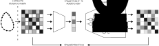

# ShapeEmbedLite

ShapeEmbedLite[^1] is a lightweight variant of ShapeEmbed[^2], designed to learn latent representations (embeddings) of 2D shapes using deep learning models trained on distance matrices derived from shape contours. It introduces a novel, geometry-aware embedding framework that efficiently encodes 2D shapes and decodes them using minimal neural architectures (shallow MLPs). This design enables fast and accurate shape analysis, particularly well-suited for small and challenging microscopy image datasets or computationally constrained environments.

<p align="center">
<picture>
  <source media="(prefers-color-scheme: dark)" srcset=".imgs/se_lite.dark.svg">
  
</picture>
</p>

## Getting started

_tested with python 3.12_

Create a virtual environment and install the dependencies as follows:
```sh
python3 -m venv .venv --prompt ShapeEmbedLite
source .venv/bin/activate
python3 -m pip install --upgrade pip
python3 -m pip install --requirement requirements.txt
```

`source .venv/bin/activate` enters the python virtual environment while a simple
`deactivate` from within the virtual environment exits it.

## Run the model

From within the created python environment, run the following:
```sh
python3 ShapeEmbedLite.py --dataset <some_name> <dist_mat_dataset_folder_path>
```

The results of the run are gathered under a
`results/output_<some_name>_<hyperparams_details>` folder.

> [!TIP]
> Running `python3 ShapeEmbedLite.py --help` will give a usage message listing hyperparameters that can be set for the run as desired:
> ```sh
> usage: ShapeEmbedLite.py [-h] (--dataset DATASET_NAME DATASET_PATH | --train-test-dataset DATASET_NAME DATASET_TRAIN_PATH DATASET_TEST_PATH)
>                          [-o OUTPUT_DIR] [-d DEV] [-w WEIGTHS_PATH] [--skip-training | --no-skip-training]
>                          [--report-only TEST_LATENT_SPACE_NPY TEST_LABELS_NPY] [-r LR] [-p [['[FACTOR]', '[PATIENCE]'] ...]]
>                          [--space-dim SPACE_DIM] [--indexation-invariant-loss | --no-indexation-invariant-loss]
>                          [--reflection-invariant-loss | --no-reflection-invariant-loss] [-e N_EPOCHS] [-n N_SPLITS_CLASSIFY] [-l LS_SZ]
>                          [-b BETA] [-t TB_LOG_DIR] [--circular-padding | --no-circular-padding]
>                          [--classify-with-scale | --no-classify-with-scale] [--preprocess-normalize NORM] [--preprocess-rescale SCALAR]
>                          [--preprocess-augment | --no-preprocess-augment] [--number-random-samples N_RND_SMLPS]
>                          [--pre-plot-rescale PLOT_RESCALE] [-s RPT_SUMMARY]
>
> run ShapeEmbedLite
>
> options:
>   -h, --help            show this help message and exit
>   --dataset DATASET_NAME DATASET_PATH
>                         dataset to use
>   --train-test-dataset DATASET_NAME DATASET_TRAIN_PATH DATASET_TEST_PATH
>                         dataset name and path to train and test sets
>   -o, --output-dir OUTPUT_DIR
>                         path to use for output produced by the run
>   -d, --device DEV      torch device to use ('cuda' or 'cpu')
>   -w, --model-weights WEIGTHS_PATH
>                         Path to weights to load the model with
>   --skip-training, --no-skip-training
>                         skip/do not skip training phase
>   --report-only TEST_LATENT_SPACE_NPY TEST_LABELS_NPY
>                         skip to the reporting based on provided latent space and labels (no training, no testing)
>   -r, --learning-rate LR
>                         learning rate (default=0.001)
>   -p, --reduce-lr-on-plateau [['[FACTOR]', '[PATIENCE]'] ...]
>                         dynamically reduce learning rate on plateau (see https://pytorch.org/docs/stable/generated/torch.optim.lr_scheduler.R
>                         educeLROnPlateau.html#torch.optim.lr_scheduler.ReduceLROnPlateau)
>   --space-dim SPACE_DIM
>                         dimension of the data passed to the model (default=2)
>   --indexation-invariant-loss, --no-indexation-invariant-loss
>                         enable/disable use of indexation invariant loss as reconstruction loss
>   --reflection-invariant-loss, --no-reflection-invariant-loss
>                         enable/disable use of reflection invariant loss as reconstruction loss
>   -e, --number-epochs N_EPOCHS
>                         desired number of epochs (default=100)
>   -n, --number-splits-classify N_SPLITS_CLASSIFY
>                         desired number of splits for classification
>   -l, --latent-space-size LS_SZ
>                         desired latent space size (default=128)
>   -b, --beta BETA       beta parameter, scaling KL loss (default=0.0)
>   -t, --tensorboard-log-dir TB_LOG_DIR
>                         tensorboard log directory (default='./runs')
>   --circular-padding, --no-circular-padding
>                         enable/disable circular padding in the encoder
>   --classify-with-scale, --no-classify-with-scale
>                         enable/disable scale preservation in classification
>   --preprocess-normalize NORM
>                         enable normalization preprocessing layer, one of ['max', 'fro'] (default None)
>   --preprocess-rescale SCALAR
>                         rescale (post-normalize if enabled) the input by SCALAR (default None)
>   --preprocess-augment, --no-preprocess-augment
>                         enable/disable augmentation preprocessing layer
>   --number-random-samples N_RND_SMLPS
>                         number of random samples to generate and plot
>   --pre-plot-rescale PLOT_RESCALE
>                         optional scaling factor for result contour plotting
>   -s, --report-summary RPT_SUMMARY
>                         desired number of report summary lines
> ```

[^1]: Foix-Romero, A., Krull, A. and Uhlmann, V., 2025. A comparison of data-driven shape quantification methods for 2D microscopy images. ICCV-BIC. [DOI]()
[^2]: Foix-Romero, A., Russell, C., Krull, A. and Uhlmann, V., 2025. ShapeEmbed: a self-supervised learning framework for 2D contour quantification. preprint [arXiv:2507.01009](
https://doi.org/10.48550/arXiv.2507.01009).
